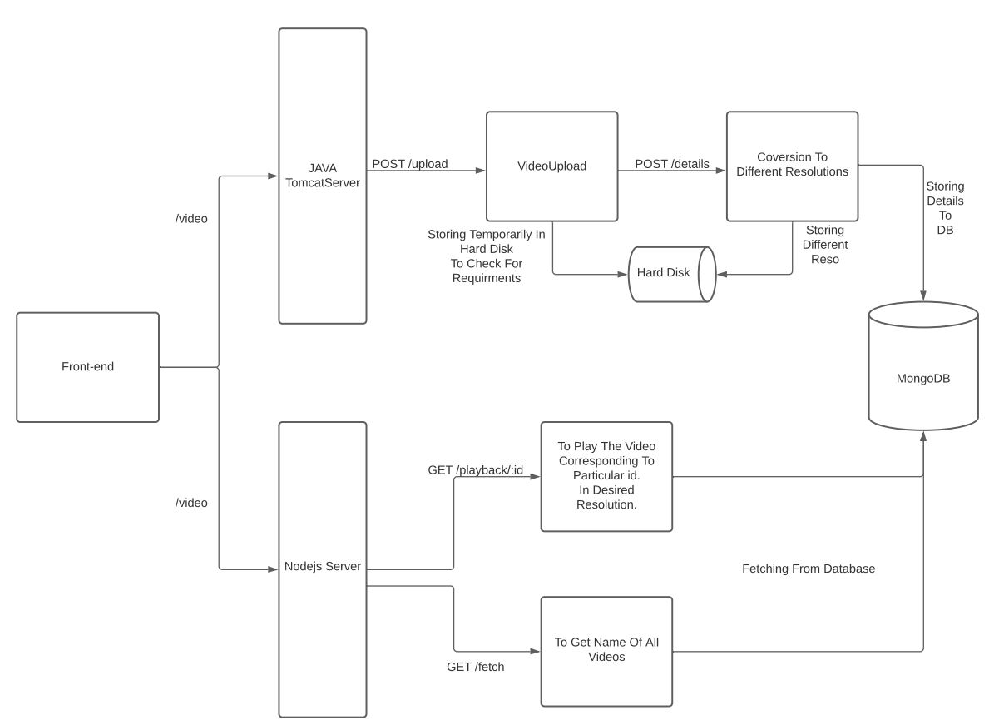

# Mini-Youtube
### Purpose Of This Application 
These days trend of short videos are on rise youtube recently realsed "Shorts" . So , taking inspiration from Youtube Shorts I decided to make this application which will allow user to upload 120 secs video .
Unlike Tik-Tok This Application is going to be targeted more towards educational and travel content ( [FireShip.io](https://www.youtube.com/channel/UCsBjURrPoezykLs9EqgamOA) is the living example that educational videos don't need to be long to make it's point)

### Tech Stack
This Project uses uses Server Side Capabilities of Nodejs and Spring Boot.       
Reasons To Use ->    
1) Java for All Kinds of Upload and Conversion Of videos to Different Resolution Process as this process is CPU intensive.So,it's better to handle it in Java.
2) Nodejs for Playback , Authentication-Authorization as these are just some simple I/O operations which NodeJs is pretty good at.

### Backend Architecture / System's Design

### End Points
| End Point          | HTTP Method   |           Description                   |  Required User registration |
| :---               |    :----:     |          :---:                           | ---:   |
| /video/upload      | POST          | To Upload Videos                        |  Yes |
| /video/fetch       | GET           | To Fetch All Available Videos           | No   |
| /video/user/registration | POST | To register the user |  No |

### Things Needed To Be Implemented In Future 
- ~~Authentication-Authorization~~
- The One who has uploaded can delete the videos
- User Interface
- Ability To Add Comments , Likes etc.

### Issues
1) Thumbnail Uploaded isn't getting converted to lower resolution.

